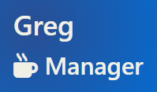
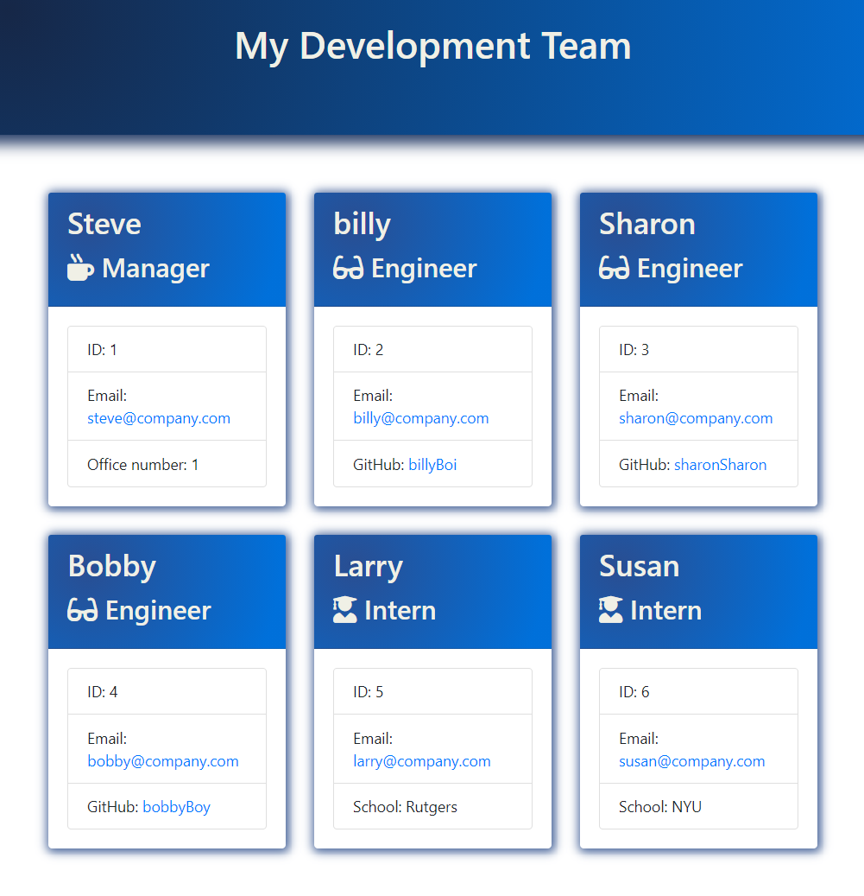
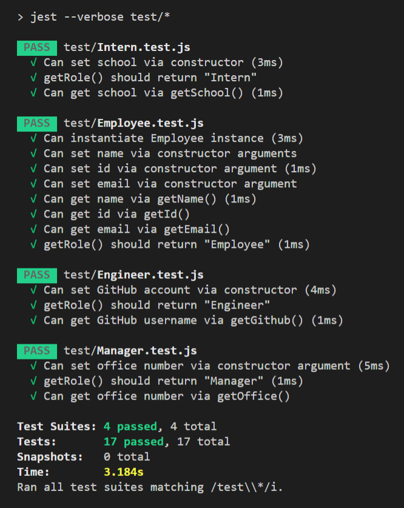

# Employee-Engine  

## Description  

This application is a Node CLI which takes in user input in order to generate an HTML page with descriptions and contact information for each member of a software engineering team. It can accomodate any number of team members who can be a combination of engineers and interns.

## Table of Contents  

- [Installation](#installation)  
- [Usage](#usage)  
- [Tests](#tests)
- [License](#license)  
- [Credits](#credits)  
- [Questions](#questions)  

## Installation  

Because this app is a command line interface, it requires git bash, Terminal, or VS Code (with Integrated Terminal) to run. Node.js (available for free download here: https://nodejs.org/en/) is also necessary, with inquirer and jest dependencies installed (using the commands `npm install inquirer` and `npm install jest`).

## Usage  

A demo video for the application is available here: (https://drive.google.com/file/d/1xDLUZG7onPRxwOnZ8fxRCgeoJJtF71sX/view)

## Tests  

The 4 test suites are designed to check if the app can set various attributes of each class using constructors and methods:

## License  

Copyright 2021 Greg Riss

Permission is hereby granted, free of charge, to any person obtaining a copy of this software and associated documentation files (the "Software"), to deal in the Software without restriction, including without limitation the rights to use, copy, modify, merge, publish, distribute, sublicense, and/or sell copies of the Software, and to permit persons to whom the Software is furnished to do so, subject to the following conditions:

The above copyright notice and this permission notice shall be included in all copies or substantial portions of the Software.

THE SOFTWARE IS PROVIDED "AS IS", WITHOUT WARRANTY OF ANY KIND, EXPRESS OR IMPLIED, INCLUDING BUT NOT LIMITED TO THE WARRANTIES OF MERCHANTABILITY, FITNESS FOR A PARTICULAR PURPOSE AND NONINFRINGEMENT. IN NO EVENT SHALL THE AUTHORS OR COPYRIGHT HOLDERS BE LIABLE FOR ANY CLAIM, DAMAGES OR OTHER LIABILITY, WHETHER IN AN ACTION OF CONTRACT, TORT OR OTHERWISE, ARISING FROM, OUT OF OR IN CONNECTION WITH THE SOFTWARE OR THE USE OR OTHER DEALINGS IN THE SOFTWARE.

## Credits  

These sources were helpful in the creation of this app:

Documentation for node.js (https://nodejs.org/en/docs/)
Documentation for npm Inquirer (https://www.npmjs.com/package/inquirer)
Documentation for npm Jest (https://jestjs.io/docs/en/getting-started)
CSS gradients from (https://cssgradient.io/gradient-backgrounds/)

## Questions  

If you have any questions about any aspect of the application, please explore the GitHub repo or reach me via email!  

[Greg's Github](https://github.com/gregriss)  
[Greg's Email](mailto:gregriss23@gmail.com)